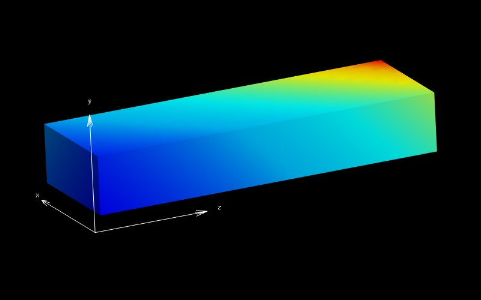

=====================================
Diffusion Equation with Linear Source
=====================================

This example solves the weak form of the following diffusion equation with a source term,

|diffusion_equation|

using the Galerkin Finite Element method. |conductivity_tensor| , |alpha| and |psi| are the positive definite and symmetric rank two conductivity tensor, a scalar parameter (e.g. thermal capacity) and a function of the dependent variable |u| (linear in this example) respectively. The dependent variable |u| is a spatially varying scalar field (e.g. temperature). In this example an isotropic and homogeneous material with |equation1| (identity tensor) and |equation2| is considered. 

The function or source term takes the following linear form.

|equation3|

In general, parameters |a| and |b| are functions of the independent variable |x|, but since the material is homogeneous (no spatially varying physical properties), they are treated as constants. 

Note that boundary conditions are prescribed to match those required for the analytical solution.

   :align: middle

   :align: middle
 

   :align: bottom
   

   :align: bottom
   

   :align: bottom
   

   :align: middle
  

   :align: bottom
   

   :align: middle
   

   :align: bottom
   

   :align: bottom   
   
   
Building the example
====================

The fortran version of the example can be configured and built with CMake::

  git clone https://github.com/OpenCMISS-Examples/diffusion_equation_with_linear_source
  mkdir diffusion_equation_with_linear_source-build
  cd diffusion_equation_with_linear_source-build
  cmake -DOpenCMISSLibs_DIR=/path/to/opencmisslib/install ../diffusion_equation_with_linear_source
  make

This will create the example executable "diffusion_equation_with_linear_source" in ./src/fortran/ directory.

Running the example
===================
Fortran version::

  cd ./src/fortran/
  ./diffusion_equation_with_linear_source

Python version::

  cd ./diffusion_equation_with_linear_source/src/python
  source  /path/to/opencmisslibs/install/.../.../virtualenvironments/oclibs_pyXY_release/bin/activate
  python diffusion_equation_with_linear_source.py

  Note: If the above fails, try the following.
  
  cd ./diffusion_equation_with_linear_source/src/python
  PYTHONPATH="/path/to/opencmisslibs/install/.../.../Release/opencmiss.iron" python diffusion_equation_with_linear_source.py  

Verifying the example
=====================
Results can be visualised by running `visualise.cmgui <./src/fortran/visualise.cmgui>`_ with the `Cmgui visualiser <http://physiomeproject.org/software/opencmiss/cmgui/download>`_.

The following figure shows the three-dimensional finite element mesh (computational domain), solution of the primary variable, |u| and source term, |psi|.

   :width: 275
   :scale: 125

   :width: 275
   :scale: 125
   

   :width: 275
   :scale: 125   

|figure1a|  |figure1b|  |figure1c|

Figure 1. (a) Finite element mesh (b) Primary variable solution (c) Source

The expected results from this example are available in `expected_results <./src/fortran/expected_results>`_ folder.

Prerequisites
=============
There are no additional input files required for this example as it is self-contained.

License
=======
License applicable to this example is described in `LICENSE <./LICENSE>`_.
